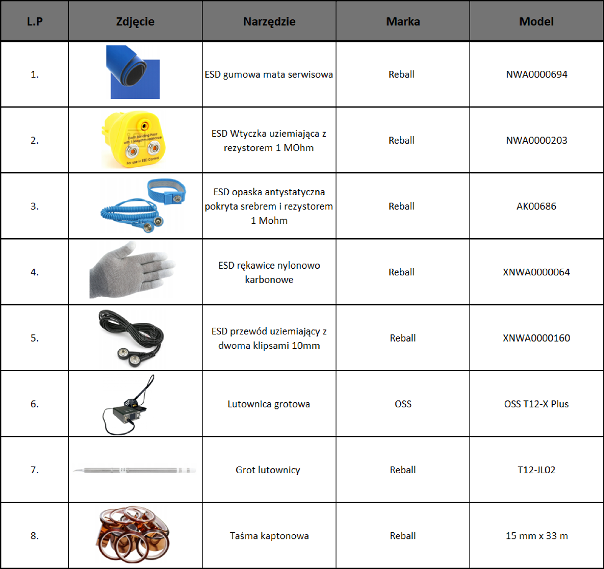
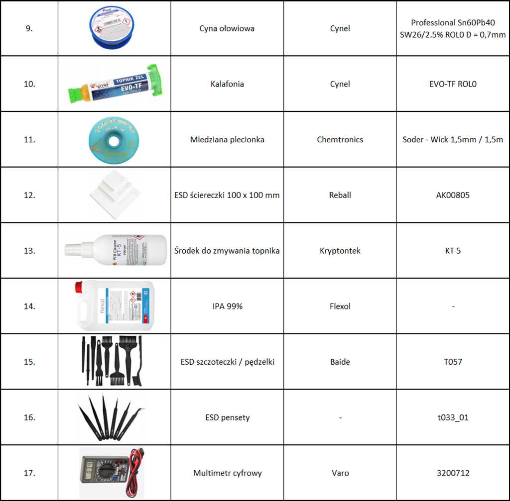
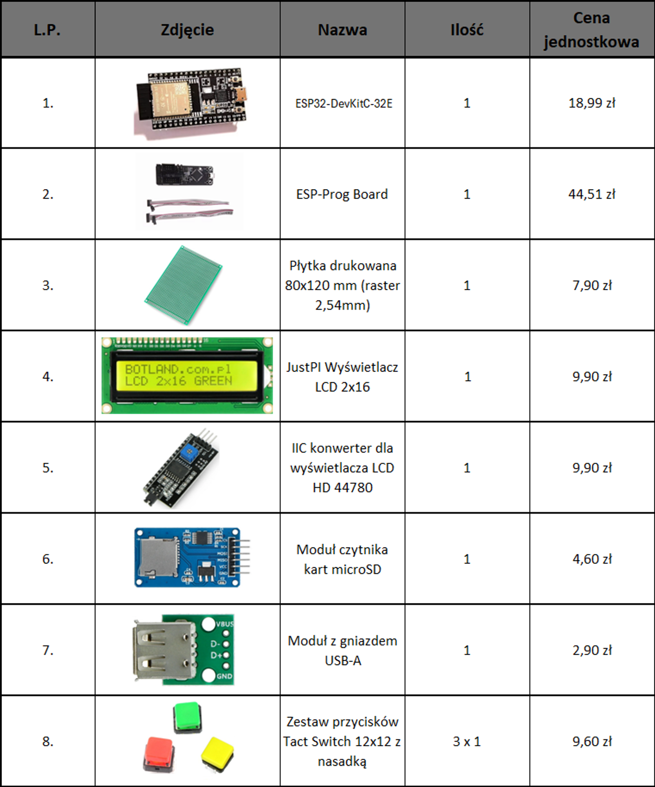
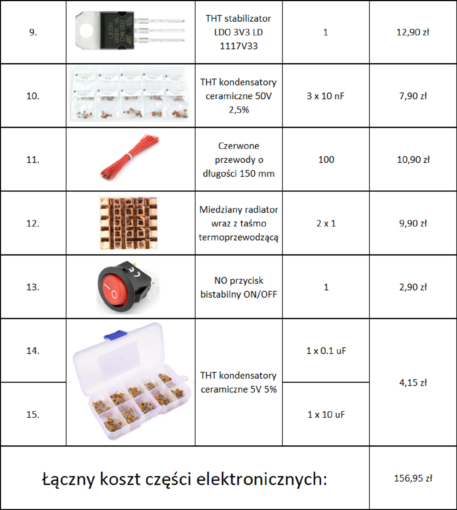

# medicine-dose-tracker
> An interactive electronics project developed as a university coursework assignment in collaboration with my partner, designed as a real-world simulation for practical use and learning.

## Features

* a
* b
* c
* d

## Hardware Design

### 1. Circuit Diagram Without Programmer

### 2. Circuit Diagram With Programmer

### 3. Assembled PCB

*Final hardware implementation of the project.*

## Used materials and tools

## Bill of materials

## 📖 Usage

